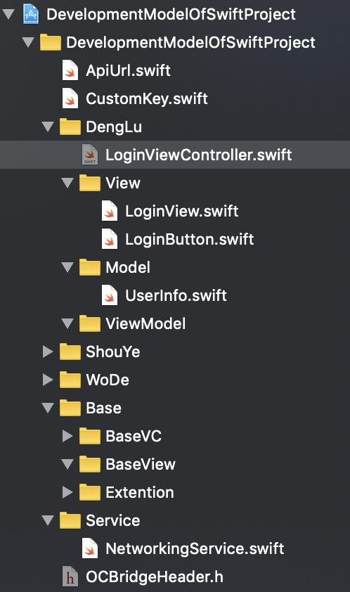

# swift工程基础开发模型

展示了怎样用swift语言开发工程，可以用于参考或者拿来直接用
 
### 工程文件布局
请先参考下图，在看下面的说明：



- 业务文件夹：里面按MVVM架构划分。例如登录业务、首页业务、我的业务
- ApiUrl：定义后端的baseUrl和接口名称等
- CustomKey：定义key、id、通知的name等
- Base文件夹：里面包含BaseVC文件夹、BaseView文件夹、Extention文件夹、tabBarController、BaseNavigationController等
- Service文件夹：独家的工具库、对系统Kit或者第三方库的封装。例如定位、通讯录、网络、存储等
- OCBridgeHeader.h：导入oc的头文件，给swift类用

### 基本知识点
- 定义全局常量

```swift
let user_login = "user/login"  //在所有的swift文件中，都可以使用
```

- 布局view

```swift
//pod 'SnapKit'
lbAmt.snp.makeConstraints { (make) in
    make.top.equalTo(38  * kWidthAdapter6)
    make.height.equalTo(32 * kWidthAdapter6)
    make.centerX.equalToSuperview()
}
```

- 闭包

```swift
var blockBtnToTouched: (() -> Void)?  //声明
viewNew.blockBtnToTouched = {self.pushSettings()}//实现
//触发实现
guard let block = blockBtnToTouched else {
	return
}
block()
```

- 网络请求和解析json

```swift
//pod 'Alamofire'，封装
    func post(path pathObj: String,
              parameters parametersObj: [String : Any]?,
              response responseObj: (@escaping (_ value: JSON?, _ errMsg:String?) -> ())
        ) {
        print("request == " + pathObj)
        print(parametersObj ?? "parameters is nil")

        let url = ServerBaseURL + pathObj
        
        Alamofire.request(url, method: HTTPMethod.post, parameters: parametersObj, encoding: JSONEncoding.default).responseJSON { (response) in
            print("response == " + pathObj)
            
            switch response.result
            {
                case .success(let value):
                    let json = JSON(value)
                    print(json)
                    responseObj(json, nil)
                case .failure(let error):
                    print(error)
                    responseObj(nil, error.localizedDescription)
            }
        }
    }

//pod 'SwiftyJSON'，解析json
let dict = json!["data"].dictionaryValue
self?.dcView.txtAmt = dict["loanMonery"]?.stringValue
self?.dcView.txtValueRepayment = dict["loanCurrentMonery"]?.stringValue
self?.dcView.txtValueDay = dict["repayDay"]?.stringValue
```

请参考[swift工程基础开发模型demo](https://github.com/dengchaojie/DevelopmentModelOfSwiftProject)
